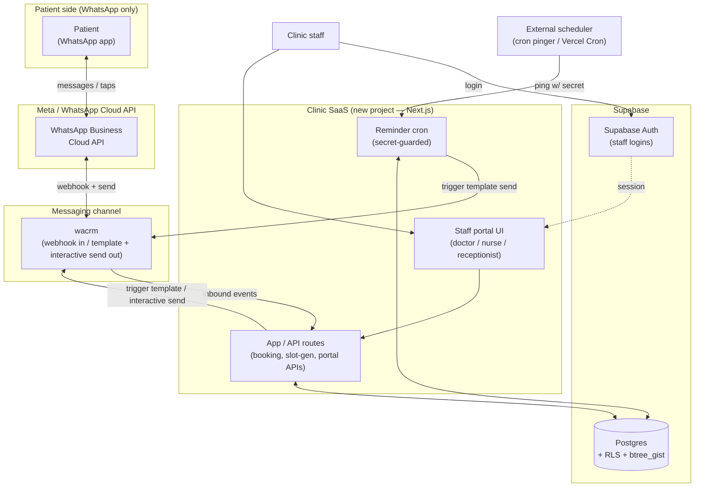
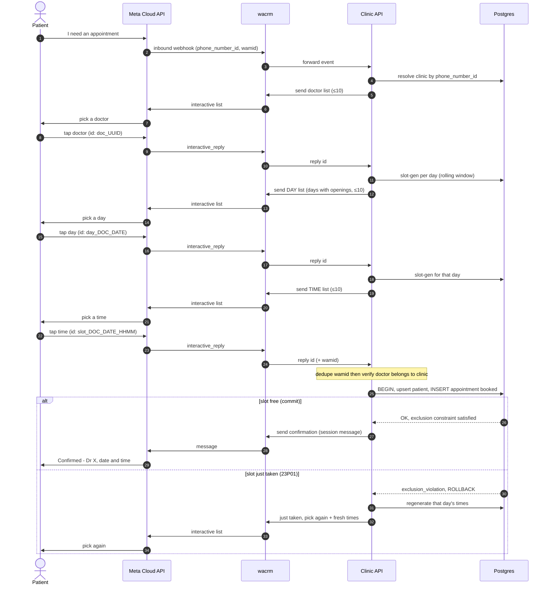
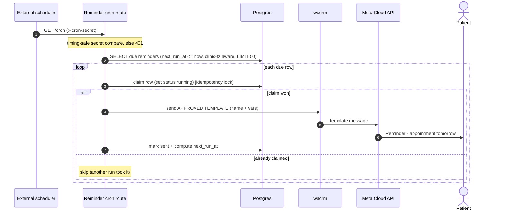
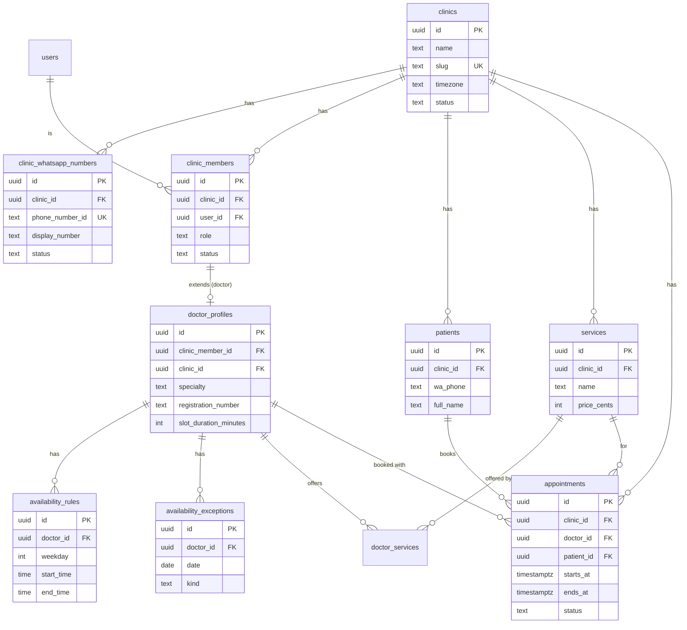
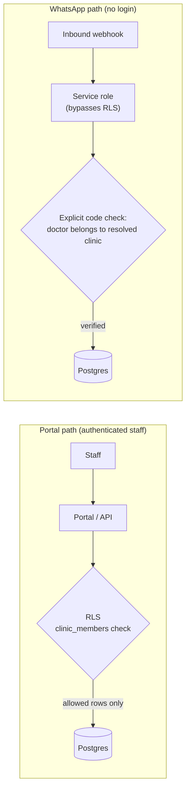

# Clinic Appointment SaaS — Technical Architecture

> Companion to `clinic-saas-plan.md`. Diagrams are Mermaid (render in GitHub,
> most IDEs, and doc tools). Reflects the agreed MVP: new clinic app + `wacrm`
> as the WhatsApp channel, Supabase (Postgres + Auth + RLS), staged booking, and
> a reminder cron sending approved templates.
>
> Note: diagrams §1–§2 show the original tap-based (interactive-row) design. The
> implemented MVP uses a numbered-text flow over `wacrm` (which forwards free
> text only) with a session in `wa_sessions`; the components, tenancy, and
> booking core are unchanged. See `clinic-saas-plan.md` §2 note.

---

## 1. System context (components & boundaries)

**Boundaries:**
- Patients never touch the clinic app directly — only WhatsApp.
- `wacrm` is the only thing that talks to Meta; the clinic app never calls Meta
  directly (MVP). Swapping to direct Cloud API later only changes this edge.
- All clinic data lives in Supabase Postgres; RLS isolates clinics for the portal.
  WhatsApp-driven writes use the service role (RLS-bypassing) with server-side
  tenancy checks.

---

## 2. Booking request (staged selection → atomic booking)

---

## 3. Reminder cron (proactive template send)

**Why template, not free text:** the cron fires days after the patient's last
message → outside the 24h window → Meta requires a pre-approved template.

---

## 4. Data model (entity relationships)

---

## 5. Tenancy & trust boundaries

**Rule:** RLS protects the portal; **server-side code** protects the WhatsApp
path (patients aren't logged in, so the service role bypasses RLS and the app
must re-check tenancy itself).
